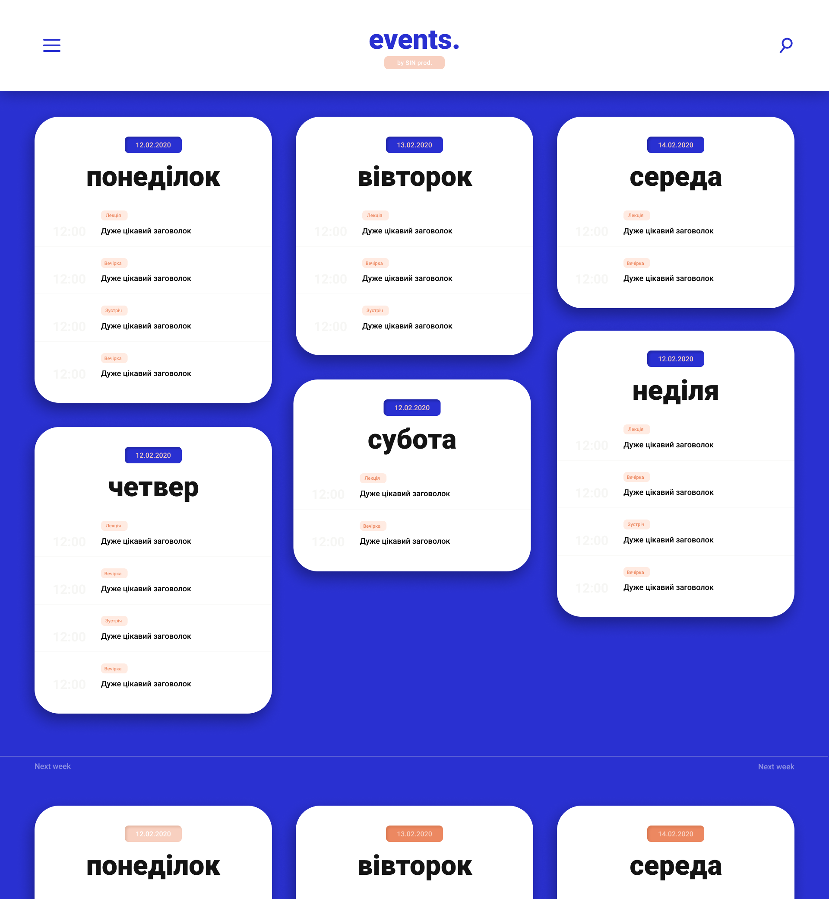
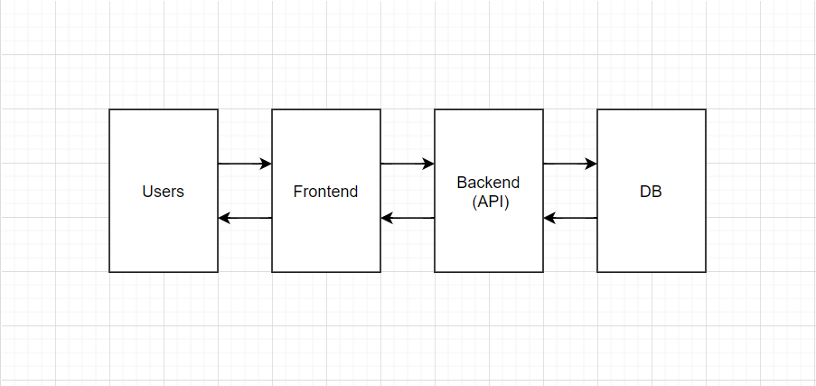

# KPIEvents
-------------------------------------------------

## What is KPIEvents?

KPIEvents is calendar that structures all events in KPI.

-------------------------------------------------
## Minimum plan

- Create simple user-friendly calendar.

- Editing existing events in the calendar with authorization, which is divided into administrators and editors.

- Administrator's review of submittet events by editors.

- Telegram bot with everyday reminders about upcoming events

## Advanced plan

- Tags assignment (organizer, venue, theme).

- Submitted events reviewing in separate Telegram Bot.

- Administrators and editors could edit events directly on the main page.

-------------------------------------------------

## Visualisation

## Technologies

**Frontend:** React, hooks 

**Backend:** Node

**DB:** PostgreSQL

**Deploy, CI/CD:** Heroku

